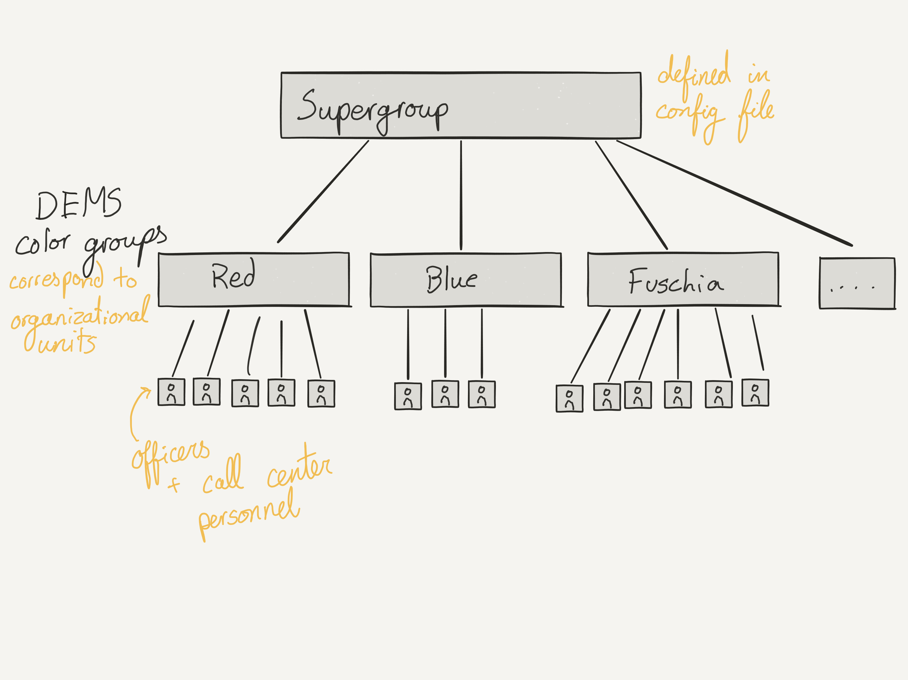

# RideAlong Response

[](https://circleci.com/gh/codeforamerica/crisisresponse)

An internal tool to help the Seattle Police Department
respond to the needs of people in crisis.

## Contents

* [Background](#background)
* [Installation](#installation)
  * [Dependencies](#dependencies)
  * [Configuring the Application](#configuring-the-application)
  * [Setting up a Development Machine](#setting-up-a-development-machine)
  * [Setting up a Production Server](#setting-up-a-production-server)
* [Production Fine-Tuning](#production-fine-tuning)
  * [Importing Data from the SPD Record Management System](#importing-data-from-the-spd-record-management-system)
  * [Backups](#backups)
  * [Scheduled Tasks](#scheduled-tasks)
  * [Setting up SSL](#setting-up-ssl)
  * [Starting the Application When the Machine Starts](#starting-the-application-when-the-machine-starts)
  * [Migrating from One Server to Another](#migrating-from-one-server-to-another)
  * [Rotating Log Files](#rotating-log-files)
    * [Application Logs](#application-logs)
    * [Import Logs](#import-logs)
    * [Backup Files](#backup-files)
* [Technical Notes](#technical-notes)
  * [System Architecture](#system-architecture)
  * [Access](#access)
  * [Importing Algorithm](#importing-algorithm)
* [Development](#development)
  * [Running Tests](#running-tests)
  * [Building the Docker Image](#building-the-docker-image)

## Background

The Seattle Police Department engaged Code for America
to help develop software to divert individuals
with mental health and addiction issues
away from the criminal justice system
and connect them to health, housing, and social services.
In 2015, the Seattle police responded to 9,675 calls to 911
that involved a person
in a mental health and/or chemical dependency-related crisis.
Specialized crisis response officers review these incidents
and follow up with the most acute cases –
contacting the person's caseworker,
speaking to their family,
and connecting the individual with local services.
The Seattle police also train patrol officers
to respond to crisis calls
and to use de-escalation techniques
with citizens in crisis.

The Seattle fellowship team is working to develop an app
for patrol officers to use
during interactions with individuals in crisis.
Focused on tailored plans
for individuals who are frequently in contact with the police,
this tool will include information such as who to call
(family members, caseworker, etc.)
and specific action steps to help the person.

[See more about the project][more].

[more]: http://c4a-sea-2016.tumblr.com/

## Installation

This should be everything you need to start the application from scratch.
If you run into any problems or obstacles,
please [open an issue] to help us improve the documentation.

[open an issue]: https://github.com/codeforamerica/crisisresponse/issues/new

### Dependencies

Because this application handles information
that is regulated by [HIPAA] and [CJIS] requirements,
it is built to be hosted on an internal police server
instead of on the cloud.
We use [Docker] to make it easy
to develop, package, and deploy the application on any platform.

Whether you're working in development or hosting on production,
the only requirement for the application is that you [install Docker].

[HIPAA]: https://en.wikipedia.org/wiki/Health_Insurance_Portability_and_Accountability_Act
[CJIS]: https://www.fbi.gov/services/cjis
[Docker]: https://docker.com/
[install Docker]: https://github.com/codeforamerica/howto/blob/master/Docker.md

### Configuring the Application

The application requires two custom files in order to run properly.

* `.env` defines configuration variables for the application
* `bin/serve` defines the processes to spin up when the application starts

Each of these files has corresponding sample configurations,
in `.sample.env` and `bin/serve.dev`.
The `./bin/setup` script will copy the sample files into place
if they don't exist, to provide a sample configuration.

See the sections on [setting up a production server](#setting-up-a-production-server)
or [setting up a development machine](#setting-up-a-development-machine)
for details on how to set up the configurations.

The variables defined in `.env` can be sensitive,
like database credentials for the Records Management System,
the variables cannot be stored in the project's git repository.
Instead, the `.env` file is ignored from git and a `.sample.env` file
is included to demonstrate the expected structure of the file.

All of the variables that can be set are shown in [`.sample.env`],
along with explanations of their functions.
At the least, you'll have to provide real values for:

* `GOOGLE_MAPS_API_KEY`
* `KEEN_PROJECT_ID`
* `KEEN_WRITE_KEY`
* `PERMITTED_USERNAME_OVERRIDES`
* `LDAP_WHITELIST_GROUP`
* `LDAP_HOST`
* `LDAP_NAMESPACE`
* `LDAP_PORT`
* `RMS_PASSWORD`
* `RMS_USERNAME`
* `SECRET_KEY_BASE`

If you fail to provide any environment variables,
the application may fail in unpredictable ways.
It is important that you understand and set the variables correctly.

When you run the [`bin/setup`] script,
`.sample.env` is copied to `.env`
to provide a starting point for your application configuration.

[`.sample.env`]: .sample.env
[`bin/setup`]: bin/setup

### Setting up a Development Machine

The application is managed through the `docker-compose` tool.
A full reference is available at https://docs.docker.com/compose/reference/,
but you can accomplish most tasks with a few commands:

```bash
# start by cloning the repository
$ git clone git@github.com:codeforamerica/crisisresponse.git && cd crisisresponse

# Set up the app for development:
$ ./bin/setup

# Run the server
$ ./bin/docker-compose up

# Stop the server
$ ./bin/docker-compose stop

# Connect to the database through the Rails Console
# See http://railsonedge.blogspot.com/2008/05/intro-to-rails-console.html
$ ./bin/docker-compose run --rm web rails c

# Connect to the database with a Postgres database connection
$ ./bin/docker-compose run --rm backup psql -h db -U postgres -d crisisresponse_development
```

After those commands,
your application should be serving the site on the port specified in `.env`.
Open <http://localhost:3000> (replacing 3000 with the relevant port)
in your web browser to see the site.

### Setting up a Production Server

To deploy to production,
set up a machine with Docker installed and follow the steps above.
Be sure to set these values in `.env`:

```
RAILS_ENV=production
RACK_ENV=production
PORT=443
```

To keep the server running when you log off,
tell Docker to run the process as a daemon.

```bash
# Run the server as a background daemon
# See other usage documentation at https://docs.docker.com/compose/reference/up/
$ ./bin/docker-compose up -d
```

To update the deploy after code changes,
run:

```bash
# Pull new code changes from GitHub,
# Migrate the database,
# and restart the server
$ ./bin/docker-compose stop &&\
  git pull &&\
  ./bin/docker-compose run --rm web rake db:migrate &&\
  ./bin/docker-compose up -d
```

## Production Fine-Tuning

### Importing Data from the SPD Record Management System

The application is only set up to import data
from the Seattle Police Department's RMS system.
These commands can only be run on the SPD or City of Seattle network,
with network access to the RMS reporting database.

* Make sure that the `RMS_PASSWORD`, `RMS_URL`, and `RMS_USERNAME`
  environment variables are set correctly in `.env`.
* Start up the application's Rails console with:

  ```bash
  $ ./bin/docker-compose run --rm web rails c
  ```

* Inside the rails console, type:

  ```ruby
  require "rms_importer"
  RMSImporter.new.import
  ```

This will run for a while as it searches for updates
to all of the crisis incident records.
When it finishes,
check the log files that it wrote under `log/import`
for notes about unprocessable records,
skipped records,
or duplicate records.

If you want to run this all as a single command, you can use:

```bash
$ ./bin/docker-compose run --rm web rails r "require 'rms_importer'; RMSImporter.new.import"
```

### Backups

Backups are stored in the `APPLICATION_ROOT/backups` folder.
They are run every time server starts,
and [Can be scheduled nightly or hourly](#scheduled-tasks).

Each backup is named with the timestamp, and is a raw PostgreSQL dump file
created with [the `pg_dump` command][pgdump].

[pgdump]: https://github.com/tldr-pages/tldr/blob/master/pages/common/pg_dump.md

You can back up and restore the database with one-off commands:

```bash
# Create a backup of the database
$ ./bin/docker-compose run --rm backup

# Restore a backup
$ ./bin/docker-compose run --rm restore backups/2016-01-02_12:00:00.sql
```

If you are using backups to transfer the application
from one machine to another,
make sure you also transfer
[the important directories](#data-stored-on-the-server)
where things like images are stored.

### Scheduled Tasks

Our system does not have a built-in mechanism for handling scheduled tasks.
Instead, it relies on [`cron`] on the host computer to trigger one-off commands.

The standard deploy of our application has two scheduled tasks,
and each has a corresponding line in the host's `/etc/crontab` file:

* (hourly) Import data from the RMS

  ```
  0 * * * * root cd /docker/crisisresponse && ./bin/docker-compose run --rm web rails r "require 'rms_importer'; RMSImporter.new.import"
  ```

* (nightly) Back up the database

  ```
  0  0  *  *  * root  cd /docker/crisisresponse && ./bin/docker-compose run --rm backup
  ```

[`cron`]: https://help.ubuntu.com/community/CronHowto

If your system does not already have an `/etc/crontab`,
you can get started with this template:

```
SHELL=/bin/bash
PATH=/sbin:/bin:/usr/sbin:/usr/bin
MAILTO=root

# For details see man 4 crontabs

# Example of job definition:
# .---------------- minute (0 - 59)
# |  .------------- hour (0 - 23)
# |  |  .---------- day of month (1 - 31)
# |  |  |  .------- month (1 - 12) OR jan,feb,mar,apr ...
# /  /  /  /  .---- day of week (0 - 6) (Sunday=0 or 7) OR sun,mon,tue,wed,thu,fri,sat
#/  /  /  /  /
#  *  *  *  * user-name  command to be executed
0  0  *  *  * root  cd /docker/crisisresponse && ./bin/docker-compose run --rm backup
0 * * * * root cd /docker/crisisresponse && ./bin/docker-compose run --rm web rails r "require 'rms_importer'; RMSImporter.new.import"
```

### Setting up SSL

To run over SSL,
the application needs an SSL certificate and an SSL private key.

To generate the key, run:

```bash
openssl req -new -newkey rsa:2048 -nodes -keyout server.key -out server.csr
```

This command creates two files.
One is the SSL key,
which should be stored in the application directory or a subfolder.
The second file, `server.csr`, is a certificate signing request (CSR).
It should be sent to the system administrator to sign.

After the system administrator signs the SSL key,
they will return either a file with the `.crt` extension,
or one with a `.pem` extension.
Our application expects the `.pem` format,
so convert the `.crt` file into a `.pem` file if necessary with:

```bash
openssl x509 -in server.crt -out server.pem -outform PEM
```

Finally,
we need to notify our application that there are SSL certificates to use.
Store all of the SSL files in `APPLICATION_ROOT/certs`,
and modify `bin/serve` to look like:

```bash
#!/bin/bash

rm tmp/pids/server.pid
(bundle check || bundle install) &&\
bundle exec rake assets:precompile &&\
env $(cat .env | sed "/^#/d") bundle exec puma -b 'ssl://0.0.0.0:3000?key=/app/certs/server.key&cert=/app/certs/server.pem'
```

Make sure to modify the variables in `.env` to match the new setup:

```bash
APPLICATION_HOST=your.domain.name
ASSET_HOST=your.domain.name
PORT=443
RACK_ENV=production
RAILS_ENV=production
```

### Starting the Application When the Machine Starts

Whenever the server loses power or restarts,
the application will need to be manually re-started by SSH'ing into the
application and running [the startup commands](#setting-up-a-production-server).

To take care of that step automatically,
it is recommended to [write a `systemd` task][systemd]
to automatically start and stop the application as a service.

There is not currently a recommended configuration for the `systemd` service.
If you create one, please [submit an issue on this repository][issue]
with the details of your setup
so we can add it to the official documentation.

[systemd]: http://unix.stackexchange.com/questions/47695
[issue]: https://github.com/codeforamerica/crisisresponse/issues/new

### Migrating from One Server to Another

In addition to the Postgres Database that runs within a Docker container,
there are several directories on the server that store sensitive information.

To copy from one machine to another,
you'll need to copy the following directories and files.
Be sure to [create a fresh database backup](#backups) before transferring
to avoid any data loss.

```bash
APPLICATION_ROOT/
|  # Configuration settings
+- .env
+- bin/serve
|
|  # Images of people in crisis, uploaded by the Crisis Response Unit
+- public/uploads/images/*
|
|  # Application and import logs
+- logs/
|  +- production.log
|  +- import/*
|
|  # Database dumps
+- backups/*
```

### Rotating Log Files

The application writes logs to the filesystem,
so it is important to have a process in place to prevent the log files from
growing too big.
At the same time, HIPAA regulations
require that we keep a log of the application's usage.
It is important to keep them stored safely.

It is recommended to set up a tool like [`logrotate`]
to break up the log files into smaller pieces intermittently.

There is not currently a recommended configuration for `logrotate`.
If you create one, please [submit an issue on this repository][issue]
with the details of your setup
so we can add it to the official documentation.

The following subsections list the log files that should be rotated.

[`logrotate`]: http://www.linuxcommand.org/man_pages/logrotate8.html

#### Application Logs

Application logs are stored under the `APPLICATION_ROOT/log` folder,
in `log/production.log` or `log/development.log`
depending on the application environment.

The application logs:

* Webpage requests, including HTTP parameters
* POST’ed form data
* Database queries
* Errors, including stack traces
* User passwords are filtered out of logs, and appear as:

  ```
  Parameters: {...
    “authentication”=>{“username”=>”sample_user”, “password”=>”[FILTERED]”},
  ...}
  ```

#### Import Logs

Log files for each import can be found after the import completes
in `<app dir>/log/import`,
under subfolders named for the rails environment and time of import.

There are three logs that are recorded for each import:

* `duplicated.csv`:

  It is possible that during an import of crisis incidents,
  we associate a single crisis incident with multiple people from the RMS.
  This situation indicates a shortcoming
  of the SQL query used to import the data (`RMSImporter::SQL_QUERY`),
  so we want to be aware of this duplication when it happens
  and be able to correct for it.

* `unimported.log`:

  At the moment, our SQL query only returns results
  for about 80% of the total number of crisis incidents.
  We would like this number to be closer to 100%,
  so it is important to know which crisis incidents
  are being left out of the import.
  This log file records all `xml_crisis_id`s that are present in the RMS
  and are not present in our application's database.

* `unprocessable.log`:

  When there is an error
  while importing a crisis incident or person record,
  the importer will log the error to `unprocessable.log`,
  along with a backtrace and the contents of the troublesome record.
  The importer will continue to import any remaining records.

#### Backup Files

Although not technically log files,
[the files generated during backups](#backups)
should be automatically removed when they get old
to save server space.

Backup files are stored in `APPLICATION_ROOT/backups`.

## Technical Notes

### System Architecture

This diagram shows the relationships
between all of the database tables in our application,
as well as how some of them interact with each other.


The application's models are defined in [`app/models/`](app/models),
and the database schema can be found at [`db/schema.rb`](db/schema.rb)

We have two tables in our database that store information imported from the RMS:
`rms_people` and `rms_crisis_incidents`.
These tables mirror the RMS database,
and are read-only within our application.
The two RMS tables are highlighted here.

We’re matching the data off of the keys
`rms_people.pin` and `rms_crisis_incidents.xml_crisis_id`.

In addition to data pulled from the RMS,
the Crisis Response Team can manually enter information about individuals
to give patrol officers more context for working with them in the field.
All tables not prefixed by `rms_` in the database schema
store information manually entered by the CRT.

### Access

In general, access to the application is limited
to SPD patrol officers & call center personnel.

**Authentication** (“who are you?”)
is based on ActiveDirectory username and password,
verified against the LDAP server specified by `LDAP_HOST` and `LDAP_PORT`.

Users enter their username and password into a form in our application,
and it gets passed on to the AD server.
The AD server returns an assertion that the user exists or not,
along with any groups that the user belongs to.

**Authorization** (“do you have permission?”)
is based on an ActiveDirectory group lookup.

To make sure the signed-in officer is authorized
to view the data in the application, we check an ActiveDirectory supergroup,
defined by the `LDAP_WHITELIST_GROUP`
[environment variable](#environment-variables).
This group contains many other ActiveDirectory groups
that correspond to organizational units, which are named after colors.
If an officer is specified in one of the color groups
that is contained in the supergroup,
then they are allowed access to our application.



The color groups were originally used to control access to the Digital Evidence
Management System (DEMS), and there are existing processes in place for adding
and removing users from the appropriate groups.

### Importing Algorithm

[`RMSImporter`] oversees and manages the importing process.
It runs an initial database query on RMS (`RMSImporter::SQL_QUERY`),
which matches crisis incidents in the RMS
with the person it was most likely written about.
After running the query,
`RMSImporter` runs the resulting records through parsers
before saving it in the database.

To modify the system to work with other RMS backends,
modify `lib/rms_importer.rb`, `lib/rms_incident_parser.rb`, and
`lib/rms_person_parser.rb`.

[`RMSImporter`]: lib/rms_importer.rb

For crisis incidents, we use:

- `RMSIncidentParser` to parse the RMS data.
- `RMS::CrisisIncident` to store the data in our application.
- `#xml_crisis_id` attribute as a unique identifier.

For personal information, we use:

- `RMSPersonParser` to parse the RMS data.
- `RMS::Person` to store the data in our application.
- `#pin` attribute as a unique identifier.

When either an `RMS::Person` or an `RMS::CrisisIncident`
is already present in our database,
we update the record's attributes with any new values from the RMS.

When we create new `RMS::Person` records,
they need to have an associated `Person` model created for them
so they can appear in the application's search results.
We create this `Person` record during the import as well.

`RMSImporter` also logs any errors that occur during the import.

## Development

### Running Tests

The application's tests are stored in the `spec/` directory,
and have the `_spec.rb` suffix.

Run the entire test suite with `./bin/test`,
or run an individual test file with `./bin/test spec/my/test/file.rb`.

### Building the Docker image

```bash
# After updating the `Dockerfile` or `Gemfile`,
# you'll need to rebuild the application container.
$ ./bin/docker-compose build

# Push a new docker image to Docker Hub:
$ ./bin/docker-compose build && docker push codeforamerica/crisisresponse
```
